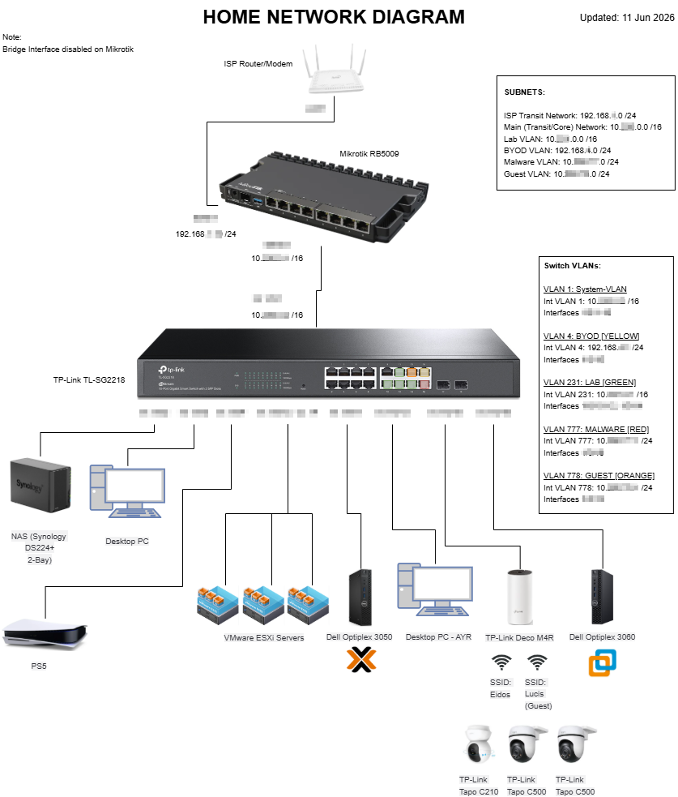
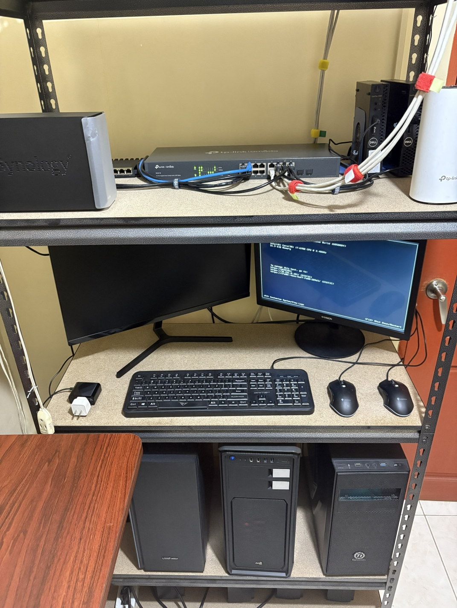
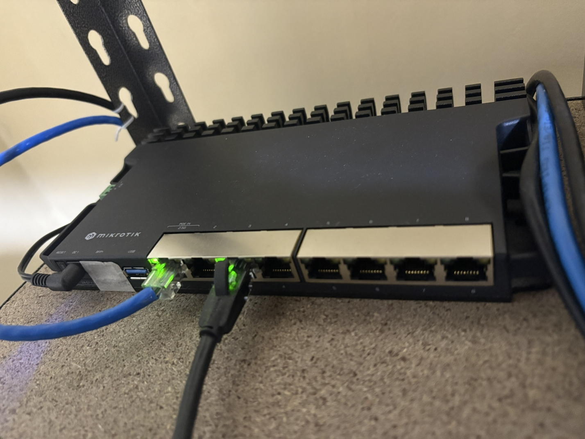
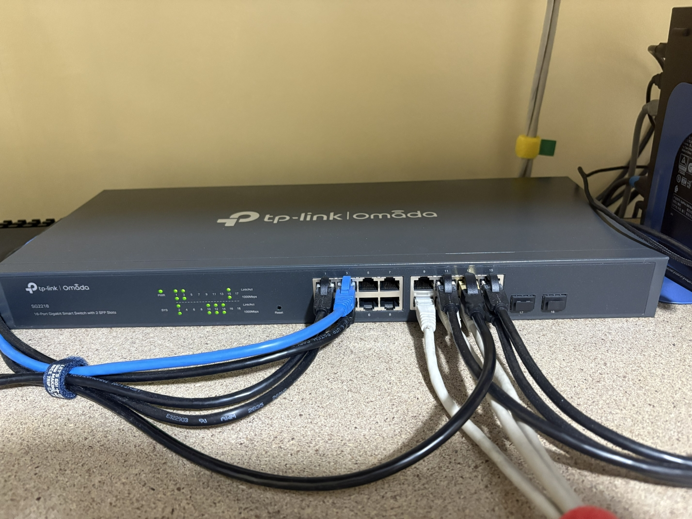
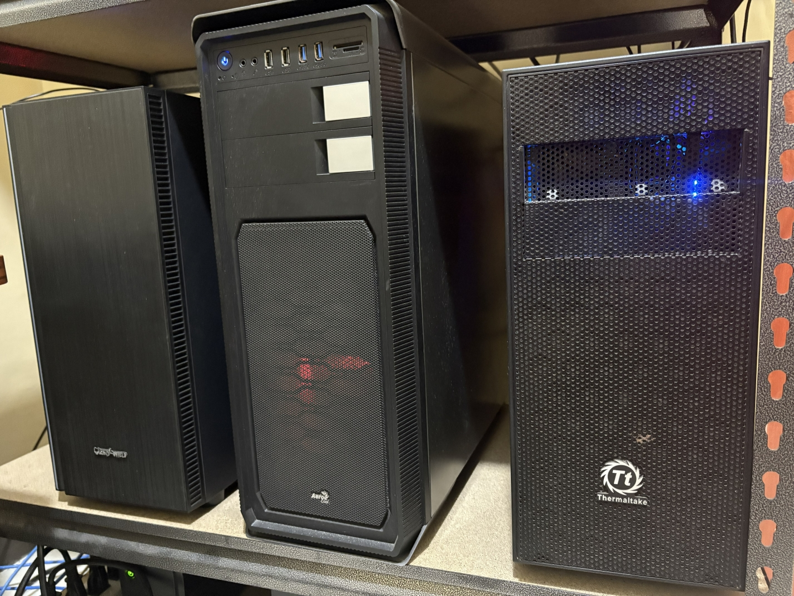
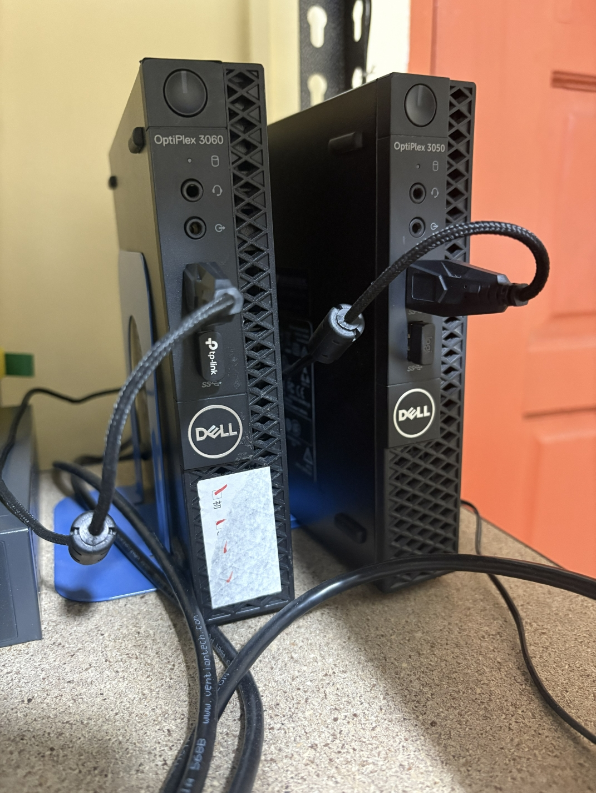
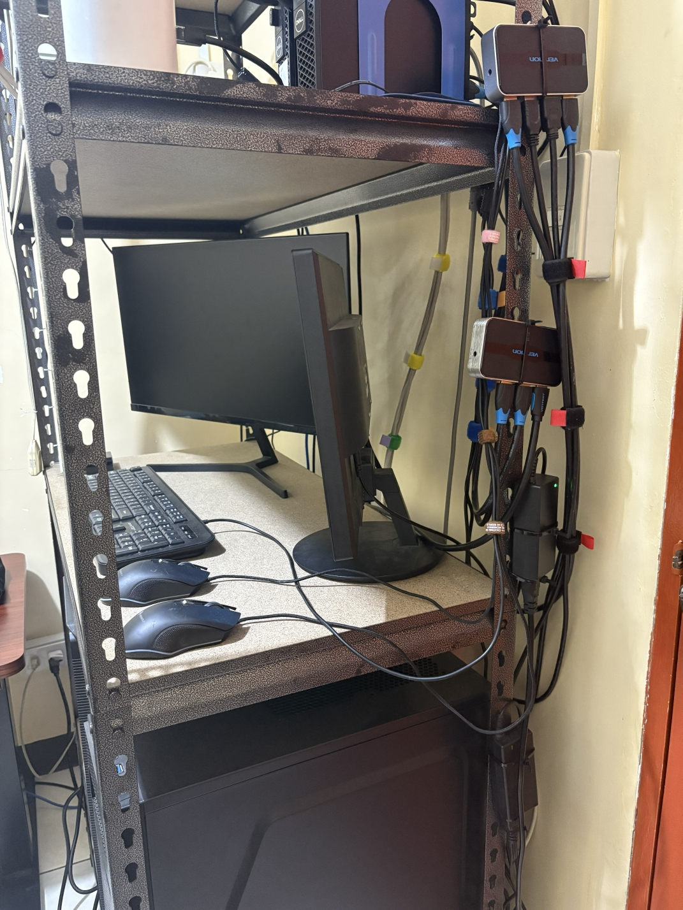

[← Back to Portfolio](./)

# 🌐 HomeLab Network Projects

Detailed documentation of my home infrastructure, focusing on network segmentation, L3 routing, and secure laboratory environments.

---

<h3 style="display:inline">🏆 🌐 HomeLab Network Architecture</h3>

*Enterprise-grade Network Segmentation / Zero Trust Design for SRE & Cybersecurity Labs.*

### 🚀 Project Overview
The goal of this project is to build a robust homelab network that separates trusted personal devices, isolated testing environments, and quarantined threat analysis zones.

* **Network Segmentation:** Multiple subnets configured for trusted traffic, IoT/BYOD, and isolated labs.
* **Layer 3 Gateway Routing:** Uses a dedicated System/Management VLAN as a transit network between the core router and switch, relying on hardware-level routing to securely handle multi-subnet traffic.
* **Security & Quarantine:** Dedicated zones for malware experimentation and secure file analysis using hardware ACLs.

### 📐 Architectural Blueprint

### 🔗 Logical Infrastructure (Source)
The network topology is defined in Mermaid.js source, demonstrating a "Documentation as Code" approach to infrastructure management.

*The Mermaid.js source is not displayed here as it contains internal infrastructure details.*

### ⚙️ Network Summary
High-level segmentation strategy.

| VLAN | Name | CIDR Block | Gateway | Target Role |
| :---: | :--- | :--- | :--- | :--- |
| **1** | **System** | `10.XXX.0.0/16` | `10.XXX.0.1` | Transit Backbone & Management |
| **4** | **BYOD** | `192.168.X.0/24` | `192.168.X.1` | Mobile Devices & Smart IoT |
| **231** | **LAB** | `10.XXX.0.0/16` | `10.XXX.0.1` | Hypervisors & Testing Sandboxes |
| **777** | **MALWARE** | `10.XXX.XX.0/24` | `10.XXX.XX.1` | Quarantined Threat Analysis |
| **778** | **GUEST** | `10.XXX.XX.0/24` | `10.XXX.XX.1` | Isolated Guest Compute |

### 🖥️ Hardware Inventory

| Device | Role | OS / Hypervisor |
| :--- | :--- | :--- |
| **Mikrotik RB5009** | Core Router & Firewall | RouterOS v7.19.6 |
| **TP-Link TL-SG2218** | L3 Distribution Switch | JetStream Managed |
| **Synology DS224+** | Centralized Storage (NAS) | DSM 7.2.2 |
| **Dell Optiplex 3050** | Virtualization Node | Proxmox VE 9.2.2 |
| **Dell Optiplex 3060** | Malware Sandbox | Win 11 Pro + Workstation |
| **ESXi Cluster (3 Nodes)** | Virtualization Nodes | VMware ESXi |
| **TP-Link Deco M4R** | Wireless Access Point | Mesh Mode |

### 🛠️ Service Catalog
*   **Core Infrastructure:** Centralized DHCP (Mikrotik), L3 Hardware Routing (TP-Link), DNS.
*   **Virtualization:** VMware ESXi, Proxmox VE, VMware Workstation.
*   **Security Lab:** Isolated Malware Sandbox, Static/Dynamic Analysis zones.
*   **Storage:** Synology File Services.

### 📸 Lab Gallery

| Rack Overview | Network Gateway/Firewall |
| :---: | :---: |
|  |  |

| Distribution Layer | Virtualization Servers |
| :---: | :---: |
|  |  |

| Additional Compute Nodes | Side Profile |
| :---: | :---: |
|  |  |

---

> 🔒 **Note on Source Code:** The full repository containing RouterOS configurations, switch ACL scripts, and detailed documentation is currently private.

---

[← Back to Portfolio](./)
